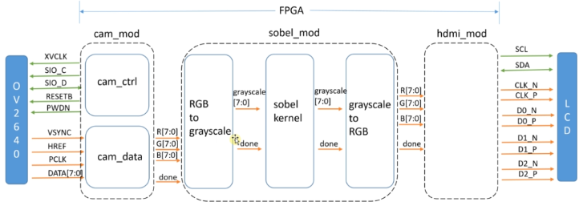

# sobel-detector-fpga

This project designs a sobel edge detector that processes an RGB image and outputs the processed RGB image in black and white where edges are enhanced. The module accepts images in .bmp format and produces the processed image in .bmp format as well. Although this project is only targeting the sobel module itself, it can be extended to include peripheral components such as camera and HDMI modules as the input and output modules for the sobel module, respectively. 

The following diagram shows the overall system diagram for this project where we focus on the ‘sobel_mod’ part:

As can be seen above, the sobe_mod module consists of three submodules:

* RGB-to-grayscale: convert the input RGB pixels to grayscale pixels
* Sobel-kernel: performs the sobel kernel filtering on grayscale pixels
* Grayscale-to-RGB: convert the processed grayscale pixels to RGB pixels

Since the sobel_mod module accepts images from the camera inputs in a real world scenario, the sobel_mod is designed as a streaming or data-flow circuit where new input images are coming to the sobel_mod module while the module produces the processed images.

The `sobel_mod` module converts a 128x128 RGB .bmp image to a grayscale .bmp image with enhanced edges:

| Input Image  | Output Image |
| ------------- | ------------- |
|   |    |

